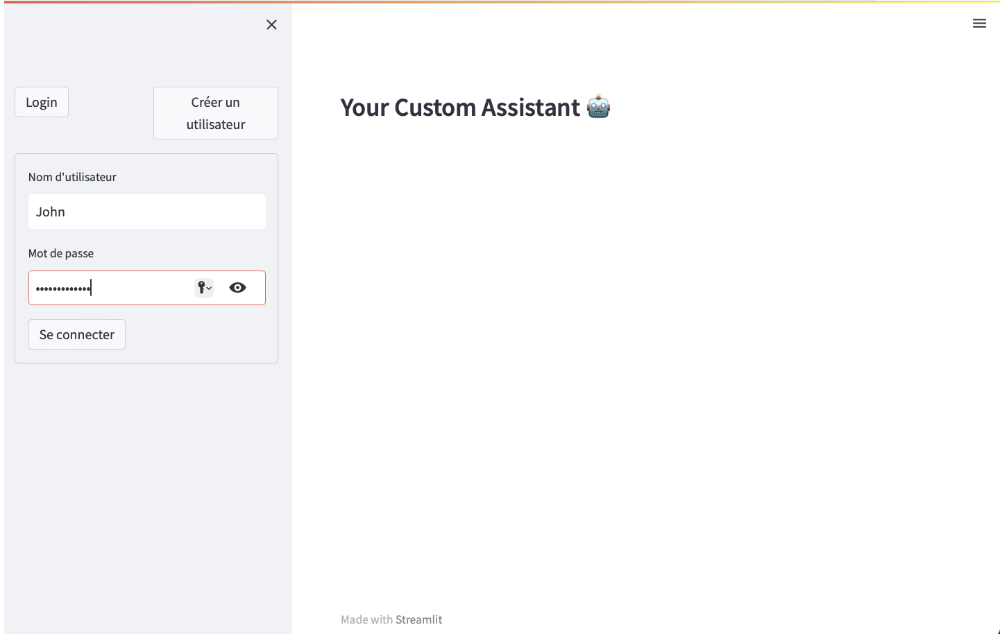

# ChatGPT-based Chatbot

Welcome to the ChatGPT-based Chatbot project! This project leverages several modern technologies to create a custom assistant chatbot. Below, you'll find details about the project's architecture, technologies used, and how to set it up.

## Technologies Used

- **FastAPI**: A modern, fast (high-performance) web framework for building APIs with Python 3.6+ based on standard Python type hints.
- **BigQuery**: A serverless, highly scalable, and cost-effective multi-cloud data warehouse.
- **AWS RDS**: Amazon Relational Database Service makes it easy to set up, operate, and scale a relational database in the cloud.
- **PostgreSQL**: A powerful, open source object-relational database system.
- **Streamlit**: An open-source app framework for Machine Learning and Data Science teams to create beautiful, custom web apps in minutes.
- **ChatGPT**: OpenAI's language model API to integrate conversational AI capabilities.
- **Langchain**: A framework for developing applications powered by language models.

## Project Screenshots

### Login Screen


### Prompt Screen


## Features

- User authentication and management.
- Integration with ChatGPT for natural language processing.
- Data storage and retrieval using BigQuery and PostgreSQL.
- Real-time interaction with a custom assistant via Streamlit UI.
- Scalable and maintainable architecture.

## Installation and Setup

### Prerequisites

- Python 3.6+
- AWS account with RDS access
- Google Cloud account with BigQuery access

### Steps

1. **Clone the repository:**

    ```bash
    git clone https://github.com/your_username/chatgpt-chatbot.git
    cd chatgpt-chatbot
    ```

2. **Create and activate a virtual environment:**

    ```bash
    python -m venv venv
    source venv/bin/activate
    ```

3. **Install the dependencies:**

    ```bash
    pip install -r requirements.txt
    ```

4. **Set up environment variables:**

    Create a `.env` file in the root directory of your project and add your configuration variables:

    ```env
    DATABASE_URL=your_postgresql_database_url
    GOOGLE_APPLICATION_CREDENTIALS=path_to_your_google_credentials_json
    ```

5. **Run the FastAPI application:**

    ```bash
    make run_api
    ```

6. **Run the Streamlit application:**

    ```bash
    make run_streamlit
    ```

## Usage

- Open your browser and go to `http://localhost:8000` to access the FastAPI docs.
- Go to `http://localhost:8501` to access the Streamlit UI.

## Contributing

Feel free to open issues or submit pull requests for any improvements or suggestions.

## License

This project is licensed under the MIT License. See the [LICENSE](LICENSE) file for more details.
